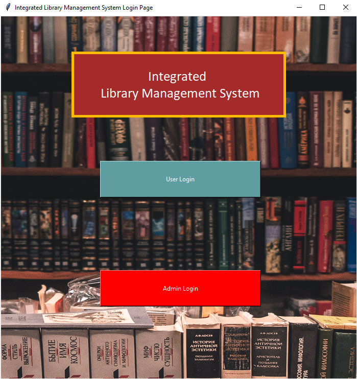

# Integrated-Library-System-ILS-
Integrated Library Management System (ILS) that can manage book borrowing, returning and other related operations efficiently and effectively.

## DESIGN REQUIREMENTS
Considering the huge volume of books this library is expected to store in the future, the IT team decides to use both
MySQL and MongoDB databases to improve efficiency and performance. More specifically, the MySQL database
is used to support library transactions such as book borrowing, returning, and reservation, while the MongoDB
database is used to support fast and efficient book search function. All book meta information (such as book ID, title,
authors, publishers, publication date, page, description, category, ISBN, etc.) are stored as book collection in
MongoDB and book search function will be directly implemented on MongoDB database. The MySQL database
stores book information (such as book ID, borrow status, reservation status, etc.) required to support book borrowing,
returning, reservation and other related transactions.
